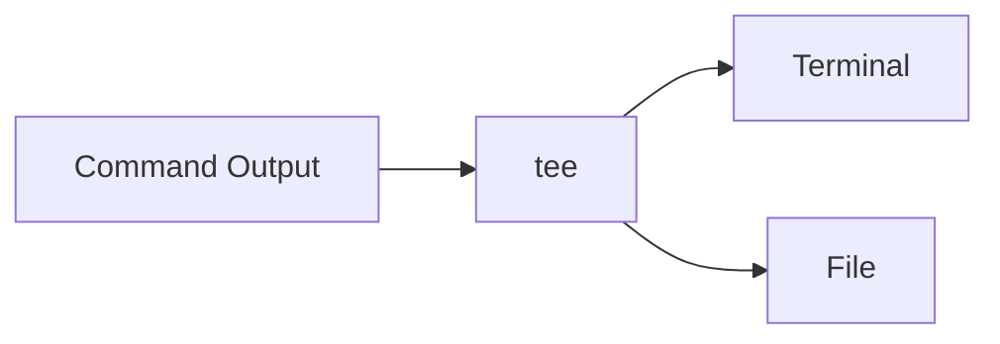
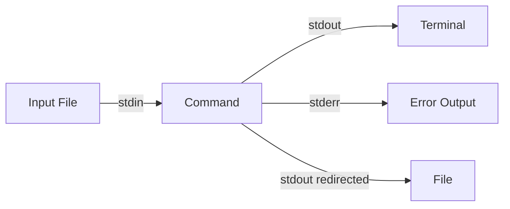

### This repository is intented only for technical purposes

### [ლექცია Meet](https://meet.google.com/fsq-gmmg-xot)

### [ლექცია Zoom](https://us02web.zoom.us/j/3038323328?pwd=QlNxQWtoZU14Rlk0RHRFbmx1MG5PQT09)

