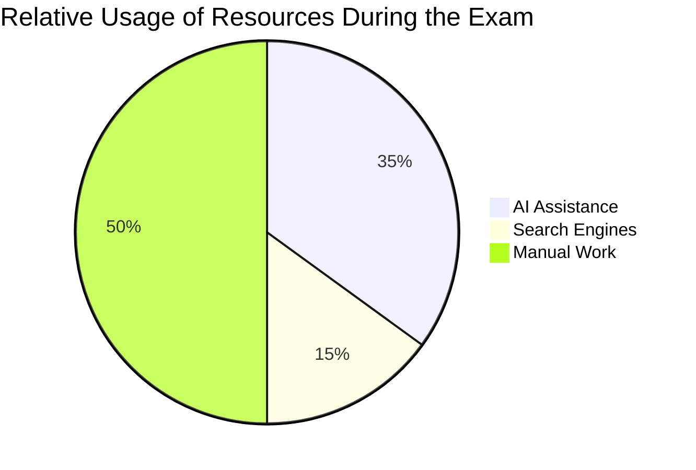

### This repository is intented only for technical purposes

### [ლექცია Meet](https://meet.google.com/fsq-gmmg-xot)

### [ლექცია Zoom](https://us02web.zoom.us/j/3038323328?pwd=QlNxQWtoZU14Rlk0RHRFbmx1MG5PQT09)





## Relative Usage Comparison

### Visualization: Effort Distribution During the Exam

```mermaid
%% Bar chart showing relative usage
bar
  title Relative Usage of Resources During the Exam
  x-axis Resource Type
  y-axis Usage Percentage
  "AI Assistance" : 35
  "Search Engines" : 15
  "Manual Work" : 50
```
